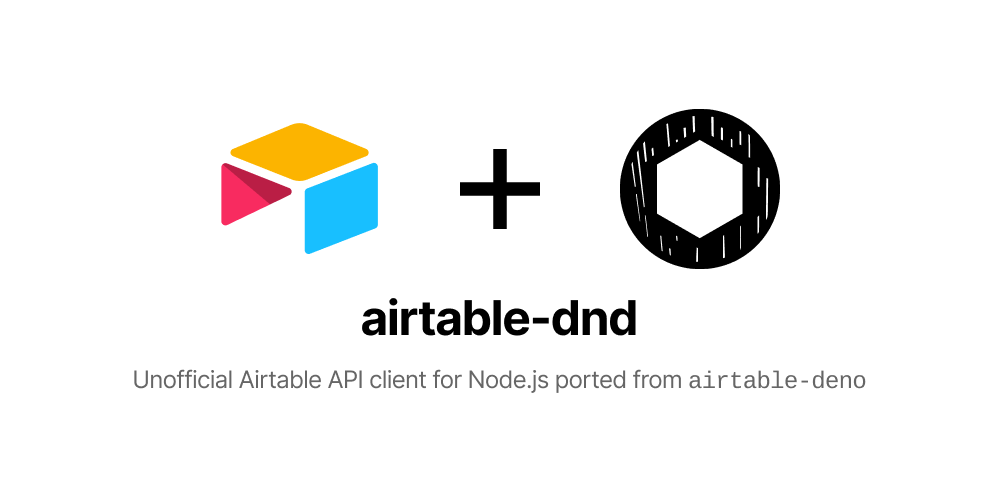

<!-- markdownlint-disable MD033 MD036 MD041 -->

<div align='center'>




</div>

---

- [Install](#install)
- [Comparison](#comparison)
- [Basic examples](#basic-examples)
- [Advanced examples](#advanced-examples)
- [Polyfilling `fetch`](#polyfilling-fetch)
- [Further reading](#further-reading)
- [Dependencies](#dependencies)
- [License](#license)

---

## Install

**Install `airtable-dnd` using npm or yarn**

```sh
# install using npm
npm install airtable-dnd

# install using yarn
yarn add airtable-dnd
```

⚠ **Important note: `airtable-dnd` internally uses `fetch` and assumes it exists** ⚠

If you're on an environment that already has `fetch` (Next.js runtimes, browsers, etc.), `airtable-dnd` will use that.

If you're on an environment that does not have `fetch`, refer to the ["Polyfilling `fetch`"](#polyfilling-fetch) section on how to implement or bring your own `fetch`.

## Comparison

**`airtable-dnd` vs. [Deno version](https://github.com/grikomsn/airtable-deno)**

- Accepts custom `fetch` on instantiation options (see ["Polyfilling `fetch`"](#polyfilling-fetch))
- Instance options are exposed unlike `airtable-deno` where it's using private identifiers (`#options`)

**`airtable-dnd` vs. [first-party Node.js version](https://github.com/Airtable/airtable.js)**

- Does not ship with `fetch` implementation (see ["Polyfilling `fetch`"](#polyfilling-fetch))
- First-class support for generic field types with extra field types (`Collaborators`, `MultipleSelect<T>`, etc.)
- Single object instance (`new Airtable()` instead of `new Airtable().base()().select()...`)

## Basic examples

**Instantiate Airtable client**

```ts
import { Airtable } from "airtable-dnd";

const airtable = new Airtable({
  apiKey: "keyXXXXXXXXXXXXXX",
  baseId: "appXXXXXXXXXXXXXX",
  tableName: "Some table name",
});
```

**Select record(s)**

```ts
const results = await airtable.select();
```

**Creating record(s)**

```ts
const createOne = await airtable.create({
  Name: "Griko Nibras",
  Age: 25,
});

import { Field } from "airtable-dnd";

type Fields = {
  Name: string;
  Age: number;
  Active?: Field.Checkbox;
};

const createMultiple = await airtable.create<Fields>(
  [
    { Name: "Foo", Age: 20 },
    { Name: "Bar", Age: 15 },
  ],
  { typecast: true },
);
```

**Updating record(s)**

```ts
const updateOne = await airtable.update<Fields>("recXXXXXXXXXXXXXX", {
  Name: "Adult boi",
  Age: 30,
});

const updateMultiple = await airtable.update<Fields>(
  [
    {
      id: "recXXXXXXXXXXXXXX",
      fields: { Name: "Adult boi", Age: 30 },
    },
    {
      id: "recXXXXXXXXXXXXXX",
      fields: { Name: "Yung boi", Age: 15 },
    },
  ],
  { typecast: true },
);
```

**Delete record(s)**

```ts
const deleteOne = await airtable.delete("recXXXXXXXXXXXXXX");

const deleteMultiple = await airtable.delete([
  "recXXXXXXXXXXXXXX",
  "recXXXXXXXXXXXXXX",
]);
```

## Advanced examples

For advanced examples, refer to the [`airtable-deno` examples file](https://github.com/grikomsn/airtable-deno/blob/master/examples.ts).

## Polyfilling `fetch`

Since Node.js does not have built-in `fetch` implementation unlike Deno, `airtable-dnd` has two ways to implement/polyfill `fetch`.

**Polyfill methods**

- **Pass `fetch` compliant object to client instantiation**

  `airtable-dnd` has [`cross-fetch`](https://github.com/lquixada/cross-fetch) as a peer dependency for polyfilling, but you can use other `fetch` compliant packages ([`node-fetch`](https://github.com/node-fetch/node-fetch), [`whatwg-fetch`](https://github.com/github/fetch), [`isomorphic-fetch`](https://github.com/matthew-andrews/isomorphic-fetch), etc.), you can import and pass the `fetch` object on client instantiation.

  ```ts
  import fetch from "node-fetch";

  const airtable = new Airtable({
    fetch,
  });
  ```

- **Polyfill `fetch` globally**

  Alternatively, you can do a global polyfill with [`cross-fetch/polyfill`](https://github.com/lquixada/cross-fetch#install) or other `fetch` compliant packages that supports global polyfilling before instantiating or calling the Airtable client.

  ```ts
  import "cross-fetch/polyfill";

  const airtable = new Airtable({
    // no need to pass `fetch` since it's polyfilled globally
  });
  ```

**Polyfill prioritization**

By default, `airtable-dnd` will use the `fetch` object passed from the instantiation option, then fallbacks to the global `fetch` object.

## Further reading

All options, parameters, errors, and responses are the same as on the [Airtable API documentation](https://airtable.com/api).

## Dependencies

- `cross-fetch`: <https://github.com/lquixada/cross-fetch>

## License

MIT License Copyright (c) 2020 [Griko Nibras](https://github.com/grikomsn)

<br />
<br />
<br />

<div align='right'>

dnd = **d**eno to **n**o**d**e :p

</div>
